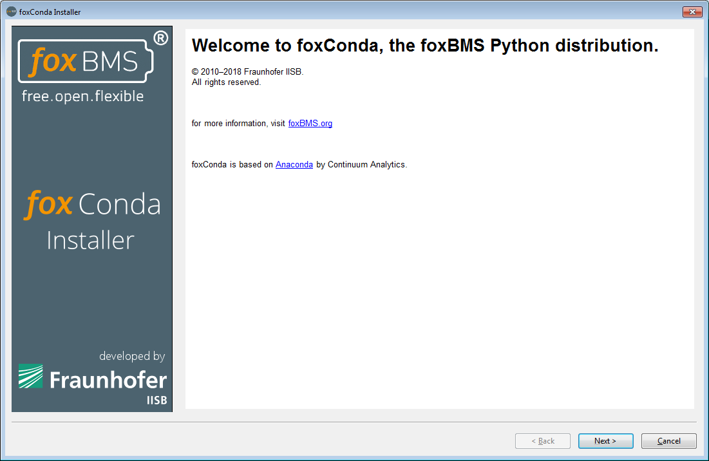

.. include:: ../../macros.rst

.. _getting_started_foxconda:

=====================
Installing |foxconda|
=====================

The |foxbms| embedded software consists of a program written in C. Before it can be flashed and run on the microcontroller units (i.e., |MCU0| and |MCU1| located
on the |BMS-Master|), it must be compiled to generate a binary file called firmware.

Different softwares (i.e., the software toolchain) are needed for this compilation step. They are based on a Python environment. All the needed software, including the Python environment, are contained in a Python distribution called |foxconda|. It will be installed in the next steps.

This section shows how to set up the development environment, |foxconda| (the software toolchain).

In the section :ref:`getting_started_eclipse_workspace`, it is shown how the compiled sources are flashed on the |Master|.

-------------------------------------------------------------------
Installation of the Needed Software via the |foxconda| Distribution
-------------------------------------------------------------------

The first step is to install the software environment needed to compile and flash the |foxbms| sources. First, the |foxconda| installer must be downloaded
from the `server <https://iisb-foxbms.iisb.fraunhofer.de/foxbms/>`_ containing the |foxconda| installers. For Windows, the installer is run by executing
|installer archive|. The installer version with the highest version and build number must always be used.

..  warning::
    -   Changing the default installation directory from ``C:\foxconda`` to something other will create a lot extra effort when setting up the 
        Eclipse workspace. It is highly advised against changing the default installation directory.
    -   When installing |foxconda| to another directory, |foxconda| must not be installed into a directory containing whitespace (e.g. ``C:\Program Files``, ``C:\Program Files (x86)``)

The window shown in :numref:`fig. %s <condainstaller1>` will appear.

.. _condainstaller1:

   Installer start page

On this window, the |foxbms| webpage can be accessed by clicking on the link in
blue.

Then by clicking on ``Next >`` the license shown in :numref:`fig. %s
<condainstaller2>` is displayed.

.. _condainstaller2:

   Installer license terms

To continue, the license terms must be accepted (check ``I accept the terms``)
before clicking on ``Next >``.

An installation directory must be selected as shown in :numref:`fig. %s <condainstaller3>`.

..  warning::
    Changing the default installation directory from ``C:\foxconda`` to something other will create a lot extra effort when setting up the Eclipse workspace. This is not advised.

.. _condainstaller3:
.. figure:: ./condainstaller3.png
   :width: 100 %

   Installation path for the |foxconda| environment

A default location is proposed. It can be changed, but it is advised to keep it. Clicking on ``Next >`` starts the installation as shown in :numref:`fig. %s <condainstaller4>`. This step can take several minutes.

.. _condainstaller4:

   Installation progress

The login credentials may be asked to generate start menu and desktop shortcuts for the development tools.

Once the installation is complete, the message shown in :numref:`fig. %s <condainstaller5>` appears.

.. _condainstaller5:
.. figure:: ./condainstaller5.png
   :width: 100 %

   Installation end

From the command line, the convenience terminal environment can be used by executing ``fbterminal.exe``, which is also located under ``FOXCONDA\Scripts``.
It will open a CMD window with a PATH environment ready to configure amd compile |foxbms|.

Software Related Frequently Asked Questions
===========================================

Where are the Sources?
----------------------

The sources are available on `GitHub <https://github.com/foxBMS/>`_.

What Libraries and Programs Must be Installed?
----------------------------------------------

None, because they are installed with the |foxconda| installer.
