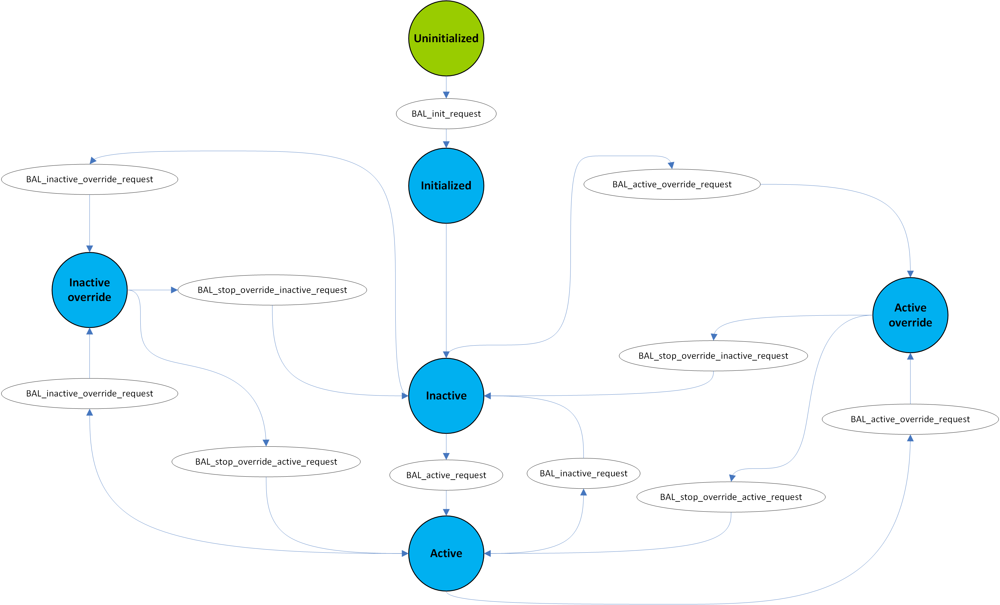

.. include:: ../../../macros.rst

.. _BALANCING:

=========
Balancing
=========

.. highlight:: C

The |mod_bal| takes care of the balancing of the cells. Balancing is deactivated by default by the switch ``BALANCING_DEFAULT_INACTIVE`` in ``embedded-software\mcu-primary\src\general\config\batterysystem_cfg.h``, which is set to ``TRUE``, to prevent unwanted balancing. The switch must be set to ``FALSE`` to activate balancing.

Structure
~~~~~~~~~

:numref:`Fig. %s <balancing_figure1>` shows the statemachine managing balancing in |foxBMS|.

.. _balancing_figure1:

   Balancing state machine

Four states are implemented:

 - ``Inactive``
 - ``Active``
 - ``Inactive override``
 - ``Active override``

In ``Inactive``, no balancing is done, but the statemachine can transition to ``Active`` with the appropriate state request. In ``Active``, the cell voltages are checked to determine if balancing is needed. If necessary, balancing orders are given via the database. The statemachine can transition to ``Inactive`` with the appropriate state request.

In ``Inactive override``, no balancing is done and the statemachine only leaves this state with a special state request. This state is activated with the switch ``BALANCING_DEFAULT_INACTIVE``.

In normal operation, the ``BMS`` statemachine requests the ``Active`` state in the ``STANDBY`` state and requests the ``Inactive`` state in the ``ERROR`` state or when leaving the ``STANDBY`` state.

In ``Active override``, the cell voltages are checked to determine if balancing is needed. If necessary, balancing orders are given via the database. The difference with the ``Active`` state is that it can only be left with a special state request.

Current Flowing through the Battery and Balancing Threshold 
~~~~~~~~~~~~~~~~~~~~~~~~~~~~~~~~~~~~~~~~~~~~~~~~~~~~~~~~~~~

When in the ``Active`` state, the |mod_bal| takes the minimum cell voltage of the battery pack and activates balancing for the cells whose voltage is above minimum + ``BAL_THRESHOLD_MV``. Once all cells have been balanced, the threshold is set to ``BAL_THRESHOLD_MV`` + ``BAL_HYSTERESIS_MV`` to avoid an oscillating behavior.

When the current flowing through the battery is below the limit ``BAL_REST_CURRENT``, the |mod_bal| waits ``BAL_TIME_BEFORE_BALANCING_S`` seconds before activating balancing on cell. The waiting time is re-initialized every time the current reaches ``BAL_REST_CURRENT``. This current limit is not considered in the ``Active override`` state.

No balancing takes place in any state if the minimum voltage of the cells in the battery pack goes below ``BAL_LOWER_VOLTAGE_LIMIT_MV``. This voltage limit is not considered in the ``Active override`` state.

Module Files
~~~~~~~~~~~~

Driver:
 - ``embedded-software\mcu-primary\src\application\bal\bal.h``
 - ``embedded-software\mcu-primary\src\application\bal\bal.c``
 
Driver Configuration:
 - ``embedded-software\mcu-primary\src\application\config\bal_cfg.h``
 - ``embedded-software\mcu-primary\src\application\config\bal_cfg.c``

